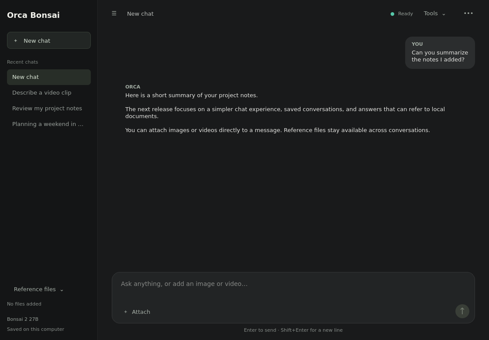
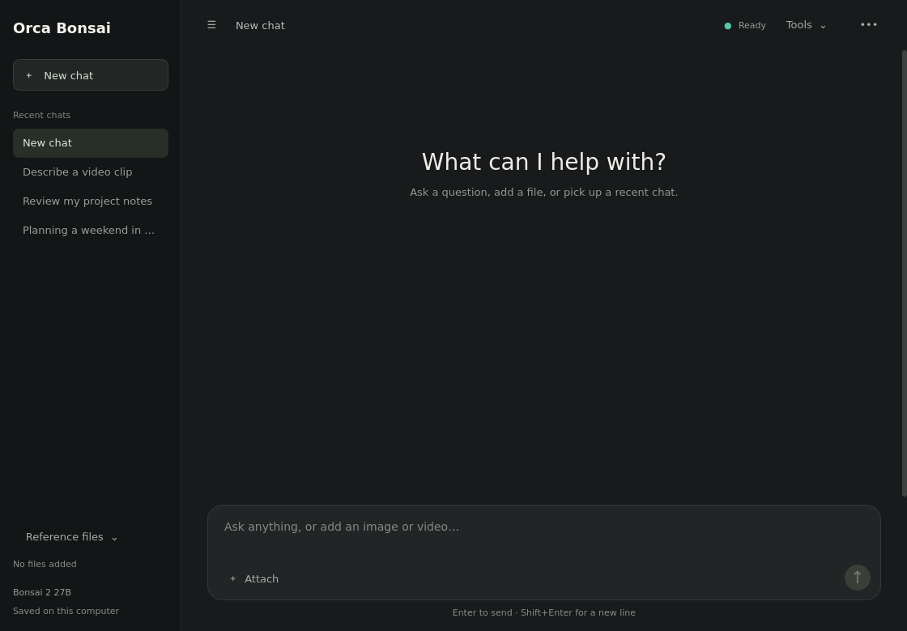

# Orca Bonsai

A minimal Linux desktop assistant for local models, terminal tools, web research, images, videos, and searchable personal documents.

Built around **Ternary Bonsai 2 27B** running through [llama.cpp](https://github.com/ggml-org/llama.cpp), with a PySide6 interface. A separate local Qwen vision model handles images and sampled video frames. Bring your own model files; this repository contains the application code.



_Screenshots use demonstration conversations; personal history is not included._

## What it can do

- **Chat locally:** use the installed model for answers and tool selection.
- **Work on your computer:** run terminal commands, read and write files, and use available X11 desktop controls.
- **Research online:** search public pages, read sources, open a separate Chromium session, and retrieve current weather.
- **Read images and videos:** attach local files for descriptions, visible-text reading, and timestamped video summaries.
- **Search reference files:** index documents locally and retrieve matching passages with source names and locations.
- **Remember conversations:** restore recent chats after restarting, retrieve matching earlier messages, and delete one chat or all chat history.
- **Report what happened:** show completed, failed, timed-out, and reused tool calls, preserve partial output, and stop repeated failures.
- **Assess an authorized website or server:** coordinate the configured web, TLS, service, and scanner checks into an evidence report.

Tool access does not make the model infallible. Results depend on the model, installed programs, permissions, hardware, and the target service. The application runs commands as your account and does not provide an additional sandbox.

## Quick start

### 1. Install the prerequisites

The application was developed on Kali Linux with X11. Use Python 3.11 or newer. The bundled video-decoder installer currently targets **Linux x86_64** with a compatible manylinux wheel; other architectures need their own PyAV installation.

For Kali/Debian, install the base tools:

```bash
sudo apt install python3 python3-venv python3-pip curl iproute2 util-linux zenity
```

You also need:

- A local `llama-server` build with Jinja chat-template support. Image/video analysis additionally requires support for Qwen3-VL and its multimodal projector.
- Your compatible Bonsai GGUF model. An accompanying GGUF LoRA is optional and must match the base model.
- Enough RAM and disk space for your model. GPU acceleration requires a compatible llama.cpp build and available VRAM; CPU execution is supported but can be slower.

Obtain the model and server from their publishers and follow their installation and license terms. Model weights, adapters, and llama.cpp binaries are not included here.

### 2. Install the Python dependencies

Clone the repository and install dependencies:

```bash
git clone https://github.com/aaka3h/orca-bonsai.git
cd orca-bonsai
python3 -m venv --system-site-packages .venv
source .venv/bin/activate
python3 -m pip install -r requirements.txt
```

`--system-site-packages` makes optional distribution-provided desktop accessibility bindings visible to the virtual environment. Keep the environment active when launching Orca.

### 3. Point Orca at your model

Use absolute paths to your local files:

```bash
export ORCA_SERVER_BIN="/absolute/path/to/llama-server"
export ORCA_MODEL="/absolute/path/to/Ternary-Bonsai-2-27B.gguf"

# Optional: use only a LoRA compatible with your base model.
# export ORCA_LORA="/absolute/path/to/compatible-adapter.gguf"

./outputs/start_orca_gui.sh
```

For a persistent desktop configuration, copy `config.example.env` to `config.env` and edit its paths. Both launchers load this local configuration. A repository `.venv` is selected automatically when present; `ORCA_PYTHON` can override it.

The launcher starts a private model API on `127.0.0.1:18080`, or reuses its matching server. It creates local runtime data under `work/`, including an API key and server log. First startup can take time while the model loads.

The model API URL is not the chat interface. Opening `/v1` in a browser without its API key can return `401`; use the desktop app or terminal launcher.



## Using the app

- Press **Enter** to send; **Shift+Enter** inserts a new line.
- Choose **New chat** to start a separate saved conversation.
- Use the sidebar for **Recent chats**, or collapse it for a simpler view.
- Use **••• → Delete chat** or **Clear chat history** to remove saved conversations. Deletion requires confirmation while the app is idle. Reference documents remain indexed separately.
- Use **Attach** for up to four images or videos.
- Use **Reference files** to add or remove documents.
- Use **Tools → Check capabilities** to inspect installed programs, the current account, desktop availability, and network state without asking the model to choose commands. Use the terminal `--capabilities` option below to skip model startup entirely.
- Press **Stop** to interrupt the current task. Closing the GUI leaves the main model server available.

For terminal use:

```bash
./outputs/start_orca_agent.sh
./outputs/start_orca_agent.sh "List the files in my Downloads folder"
python3 outputs/orca_agent.py --capabilities
```

At the interactive prompt, `/new` begins a new saved conversation.

## Images and videos

Install the optional local vision model and decoder with the Python environment active:

```bash
python3 outputs/setup_orca_vision.py
python3 outputs/setup_orca_media.py
```

The vision installer downloads a pinned revision of [Qwen3-VL-2B-Instruct-GGUF](https://huggingface.co/Qwen/Qwen3-VL-2B-Instruct-GGUF), verifies hashes, and stores its model and projector under `work/vision-models/`. Together they require about 1.55 GB. The decoder installer places pinned PyAV dependencies under `work/media-deps/`.

If your vision-capable server differs from the main server, set `ORCA_VISION_SERVER` to its absolute path before launching. Vision inference runs on the CPU through a temporary private loopback service. Selected media is processed locally.

Examples:

```bash
./outputs/start_orca_agent.sh --media /absolute/path/image.png "Explain the visible error"
./outputs/start_orca_agent.sh --media /absolute/path/video.mp4 "Summarize the visible events with timestamps"
```

Supported images are JPEG, PNG, WEBP, BMP, and GIF, up to 50 MiB and 40 megapixels. Images are resized to a maximum 1024-pixel longest edge. GIF analysis uses the first frame.

Supported videos are MP4, MKV, MOV, WEBM, AVI, and M4V, up to 2 GiB. Analysis normally samples six frames; the media tool supports up to twelve. Answers show timestamps and sampling limitations. Brief events between samples can be missed, and small text can be misread. Audio and subtitles are not separately transcribed.

## Reference documents and conversation memory

Add local TXT, MD, CSV, JSON, LOG, PDF, or DOCX files through **Reference files**, then ask about their contents. Re-add edited files to refresh the index. Removing a reference removes its index entries and keeps the original file.

RAG uses [SQLite FTS5](https://www.sqlite.org/fts5.html) keyword search and ranking. It does **not** use vector embeddings or a cloud embedding API. Specific terms and names from the document improve retrieval. Answers list retrieved passages with file names and locations; retrieval alone does not validate every claim in an answer.

Indexing limits are 40 MB per file, 100 PDF pages, and 600,000 extracted characters. PDFs need an existing text layer; scanned pages require OCR first. DOCX extraction covers body text. The app reports partial indexing and extraction errors.

New chat messages and reference indexes are saved in `work/orca-memory/memory.sqlite3`. Recent messages enter the next request; explicit recall questions can retrieve matching older messages. The saved history is larger than the model context, so not every old detail is visible to the model at once. The GUI restores the latest 40 messages of a selected chat. Media paths and answers are saved, but image and video bytes are not stored in the conversation database.

## Browser and desktop tools

For the separate interactive browser, install Node.js/npm and Chromium, then run:

```bash
npm install --prefix work/browser-agent agent-browser
```

The browser uses a separate profile in `work/browser-profile/`; it does not attach to your existing browser tabs. Its default Chromium path is `/usr/bin/chromium`. Web search and page fetching can work without this browser runtime. Sites may still block automated access or require human verification.

X11 pointer, keyboard, and window controls require `xdotool`. Accessible-control inspection additionally requires AT-SPI bindings, which Kali/Debian can provide with:

```bash
sudo apt install xdotool python3-gi gir1.2-atspi-2.0
```

Desktop control depends on the application exposing accessible controls. Wayland support is not implemented for the X11 automation tools. GUI administrator actions use a separate Zenity password dialog; terminal administrator actions use the normal `sudo` prompt. Enter passwords there, never into the chat.

## Authorized security assessments

For a website or server you own or have permission to test, choose **Tools → Full security scan**, enter the target and TCP port scope, review the draft, and send it unchanged. The configured workflow attempts:

1. Tool inventory and available update information.
2. HTTP response, redirect, header, and TLS checks.
3. Nmap TCP discovery and light service identification.
4. A bounded same-origin crawl with passive ZAP analysis.
5. Restricted Nikto checks and selected signed Nuclei detection templates.
6. Advisory lookups for observed products, versions, or CVE identifiers.

Install the desired scanner programs separately and make them available on `PATH`. Missing tools, timeouts, update failures, and incomplete coverage appear in the report. A scanner match remains an unverified candidate until validated.

Reports are written to `outputs/security-reports/<assessment-id>/`, including `REPORT.md`, a machine-readable manifest, and tool evidence. **Tools → Open scan report** opens the saved report. A stopped assessment retains collected evidence.

“Full” means every configured stage is attempted. It does not cover UDP, subdomain discovery, authenticated application logic, form submission, full active ZAP scanning, exploitation, password attacks, or denial of service. A clean report cannot prove the absence of vulnerabilities.

## Reliability and limits

The terminal runner propagates shell pipeline failures, keeps partial timeout output, and recognizes common error diagnostics. Error recognition is heuristic: a zero exit code is not proof that the requested outcome succeeded. An identical failed request runs at most twice within a task; repeated unsuccessful rounds stop with a summary. The ordinary model loop also has a 24-step limit.

Incomplete JSON tool arguments are rejected before execution and retried within a bounded recovery path. The app periodically compares collected evidence with the request and summarizes unresolved work when it must stop. Hardware features and software permissions cannot be created by prompting the model.

**Stop** interrupts the agent and its process group. Cleanup attempts cover discoverable child processes; programs that detach into another session may need separate management. The model server stays running for the next request.

## Local data and troubleshooting

Runtime state is kept under `work/`: model-server logs and credentials, conversation memory, reference indexes, browser profile, downloaded vision files, and optional dependencies. Generated assessment reports are under `outputs/security-reports/`. These locations are excluded from version control. Review them before sharing logs or reports.

Local inference and document indexing do not upload your documents to a cloud model. Internet tools send requests to the services you use, and commands selected by the agent run with your account's access.

If startup fails, check `work/orca-gui.log` and `work/llama-server.log`. Confirm the virtual environment is active, the configured model/server paths exist, and port `18080` is available. Restart the app after updating code. An already-running model server retains its original configuration until restarted.

To stop a server launched from this repository:

```bash
kill "$(cat work/llama-server.pid)"
```

For available terminal options:

```bash
python3 outputs/orca_agent.py --help
```

## Development

Application modules and launchers live in `outputs/`; regression tests live in `tests/`.

```bash
python3 -m pip install -r requirements-dev.txt
mkdir -p work
QT_QPA_PLATFORM=offscreen ORCA_MEMORY_DB="$PWD/work/test-memory.sqlite3" python3 -m unittest discover -s tests -v
```

The default regression suite uses synthetic fixtures and mocked remote services; it does not run assessments against real websites. Some integration checks require optional local runtimes or external tools and may skip when those are unavailable. Tests are not a guarantee that every combination of model, operating system, and hardware is supported.

## Models and third-party software

Model weights and LoRA adapters are distributed separately by their publishers and retain their own license terms. The same applies to llama.cpp, Qwen, browser automation, PySide6, PyAV, and optional security tools. This repository does not redistribute those model weights or grant rights to them.
